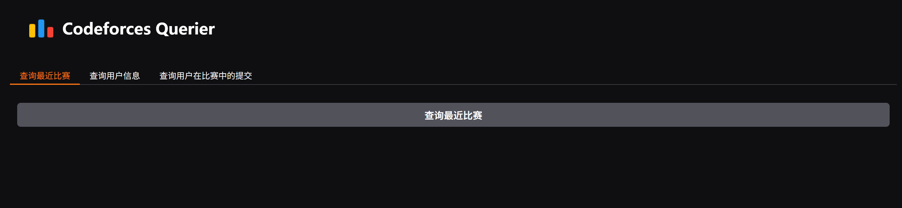
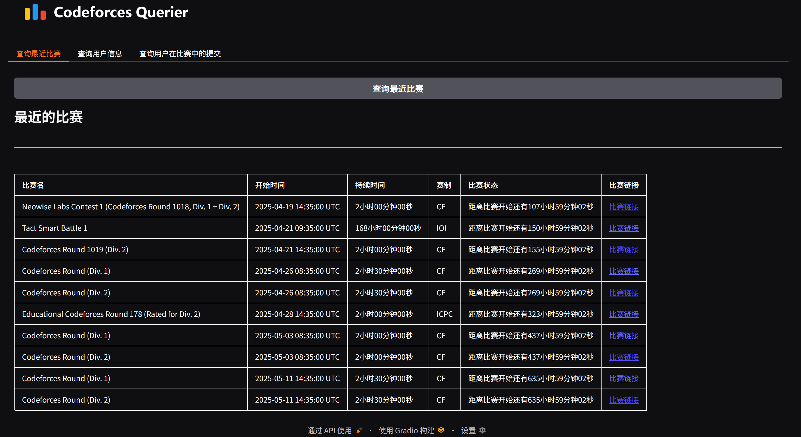
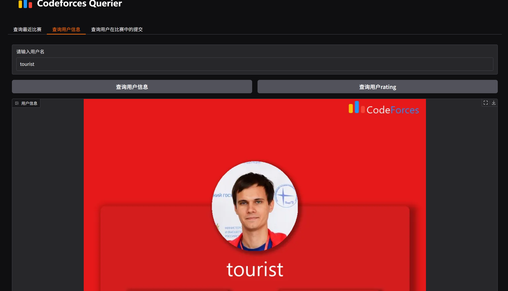
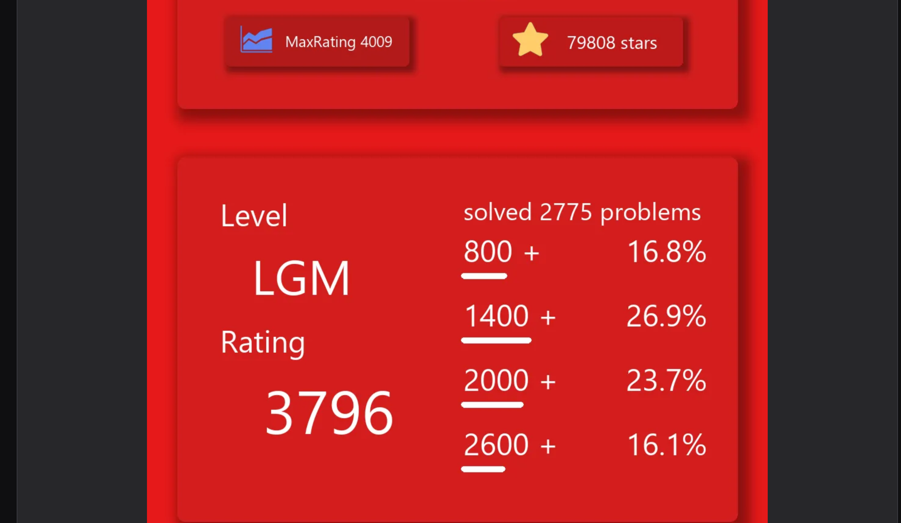
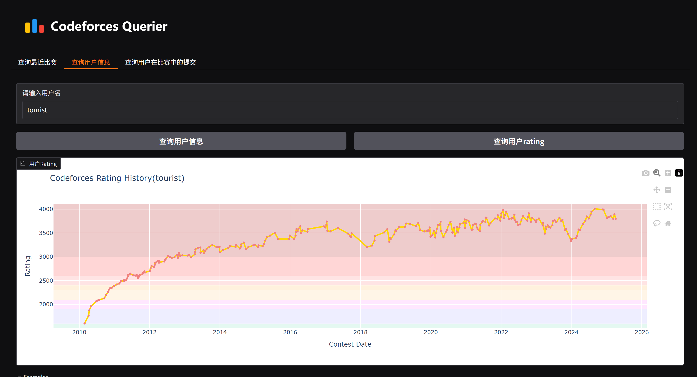
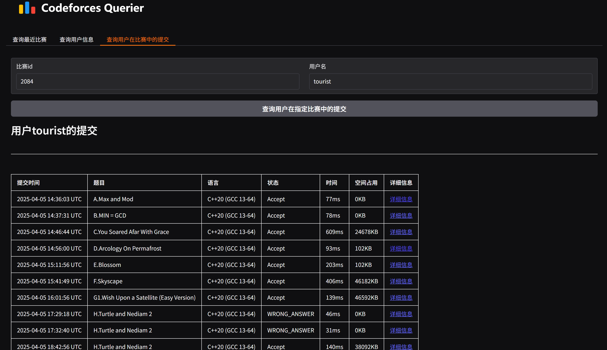

<div align=center>


</div>

<div align=center>


</div>

<div align=center>

# ✨Code<font color=DodgerBlue>forces<font color=white> Querier✨


</div>

<div align=center>
</div>

## ❓ What's this

---

这是一个用于查询算法竞赛网站Codeforces上用户和比赛信息的小项目

## 🚀Quick start

---

首先安装依赖
```shell
pip install -r requirements.txt
```
运行项目
```shell
python FrontPage.py
```
CLI输出
```shell
* Running on local URL:  http://127.0.0.1:7860
```
点击[URL](http://127.0.0.1:7860)即可进入webUI

## ⚙️实现功能

---

| 功能 | 返回值 | 说明  |
| --- | --- |-----|
|获取近期比赛|包含近期即将开始和进行中的比赛信息|比赛信息以表格形式呈现|
|获取用户信息|返回用户基础信息|用户信息以实时渲染的图片呈现|
|获取用户rating|返回用户rating图表||
|查询用户在指定比赛中的提交|返回用户的提交信息||

## 🌰使用示例

--- 
### 查询最近比赛
首先来到主页面

点击`查询最近比赛`即可看到最近的比赛信息

### 查询用户信息
点击侧栏查询用户信息,输入用户名点击`查询用户信息`即可得到含有用户基本信息的一张图片

点击`查询用户rating`即可查询用户rating的变化表


### 查询用户在指定比赛中的提交
点击侧边栏查询用户在比赛中的提交,输入比赛id(不是比赛名)和用户名,点击`查询用户在指定比赛中的提交`即可查看用户在指定比赛中的提交


## ✅ TODO

---

无
## 💐 感谢

---
感谢你注意到这个仓库